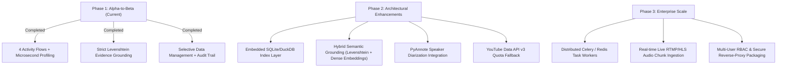

# ⚠️ System Limitations and Technical Challenges

**Document Status:** Current Architecture Assessment (v1.0.0)  
**Classification:** Engineering Architecture & Operational Reference  
**Last Updated:** September 2026  
**Target Environment:** Local Workstation / Intranet Deployment  

---

## Executive Summary

The **Political YouTube Channel Activity Monitor** is a production-grade, local-first intelligence system engineered to ingest, transcribe, analyze, ground, profile, and report on political video, short, community post, and live broadcast content. Its foundational design emphasizes **strict evidence grounding** (zero unverified claims), **privacy & zero cloud cost** (100% local execution via CUDA Whisper and Ollama LLMs), and a **file-first audit trail** (transparent JSON/HTML storage).

While the system is robust, verified across 45 automated tests, and proven on real-world political channels (@SansadTV, @NarendraModi), operating at scale on local workstation hardware reveals technical boundaries, upstream dependencies, and architectural trade-offs.

This document provides a comprehensive, transparent inventory of the system's **current limitations**, **operational challenges**, and the **mitigation roadmap** planned for subsequent engineering phases.

---

## 1. Upstream Data Ingestion & YouTube Interface Constraints

### 1.1 Scraping Dependency vs. Official YouTube Data API v3
* **Current State:** Channel discovery, video cataloging, community post scraping, and live broadcast detection currently rely primarily on `yt-dlp` and HTTP scraping rather than the Google Cloud YouTube Data API v3.
* **Limitations & Risks:**
  * **IP Rate Limiting & Throttling:** Rapid, continuous crawling of multiple high-frequency channels can trigger YouTube HTTP `429 Too Many Requests` or anti-bot challenge screens (bot detection, CAPTCHAs).
  * **HTML DOM Volatility:** The YouTube Community tab does not provide an official RSS feed or public API endpoint. Scrapers rely on internal YouTube JSON payloads (`ytInitialData`). Any structural change deployed by YouTube engineering can temporarily break post extraction until parsers are updated.
  * **Network Fragility:** Temporary packet loss or connection drops during long metadata queries can cause individual item extraction retries.
* **Current Mitigation:**
  * Exponential backoff, jittered request pacing, and user-agent rotation.
  * Comprehensive error-catching and fallback to cached state files.
* **Roadmap Upgrade:** Integration of an optional, user-configurable YouTube Data API v3 credential layer with automatic quota fallback to `yt-dlp`.

### 1.2 Community Post Formatting & Multimedia Nuances
* **Current State:** Community posts are extracted directly as text, status codes, and attached image URLs.
* **Limitations:**
  * **Complex Embedded Elements:** YouTube Community posts featuring multi-image carousels, embedded poll options with live voting percentages, or quiz widgets have rich nested metadata that is flattened into plain text and primary image URLs.
  * **Nested Comment Conversations:** The system monitors the primary author post. It does not monitor or analyze comment replies, audience sentiment, or discussion threads below the post.

### 1.3 Live Stream Ingestion: VODs vs. Real-Time Streaming
* **Current State:** The system detects active live broadcasts, marks them in the live monitoring table, and fully ingests the completed broadcast as a Video on Demand (VOD) once the stream ends.
* **Limitations:**
  * **Real-Time Stream Splitting:** The system does not currently slice and transcribe ongoing RTMP/HLS audio in rolling 60-second chunks while the live rally or speech is actively in progress. Complete transcription and LLM extraction occur only after the broadcast concludes or when a chunk is manually recorded.
* **Current Mitigation:**
  * Live status tracking (`is_live: true`) flags ongoing events in the console and UI.
  * Automated transition to full transcription once the stream finishes.

### 1.4 Post-Publication Metadata Changes
* **Current State:** Ingestion is keyed on the YouTube video ID (`item_id`) stored in `state/processed_ids.json`.
* **Limitations:**
  * If a channel administrator edits a video title, description, or thumbnail retroactively (common practice among news agencies optimizing click-through rates), the system does not re-crawl previously completed items automatically unless the operator issues a selective purge via the Data Management hub.

---

## 2. Audio Extraction & Multilingual Transcription Bottlenecks

### 2.1 Acoustic Realities of Political Content
* **Current State:** Faster-Whisper (`float16` on CUDA with Silero VAD) handles Hindi, English, and Hinglish speech.
* **Challenges:**
  * **Parliamentary Crosstalk & Shouting:** In heated parliamentary debates (e.g., Sansad TV Lok Sabha sessions), multiple MPs frequently speak simultaneously over background noise, slogans, and desk thumping. In such segments, Whisper's Voice Activity Detection can either over-filter noisy speech or merge overlapping speakers into single unstructured text blocks.
  * **Open-Air Rally Distortion:** Speeches recorded at election rallies frequently suffer from acoustic echo, loudspeaker distortion, microphone wind clipping, and crowd sloganeering, which can degrade word error rates (WER).
  * **Non-Verbal Broadcast Pauses:** Long silent stretches or patriotic musical interludes between speeches can occasionally cause Whisper to enter repetition loops (generating identical tokens) unless strict temperature fallback and repetition penalties are enforced.

### 2.2 Regional Dialects & Code-Switching Complexity
* **Current State:** The system handles Hindi (Devanagari) and English, as well as Romanized Hinglish.
* **Challenges:**
  * **Regional Dialect Vocabulary:** In local political speeches (e.g., Uttarakhand regional rallies featuring Garhwali or Kumaoni idioms, colloquial proverbs, or local administrative schemes), standard Whisper models trained predominantly on standard Khari Boli Hindi can misinterpret regional phonetic spellings or mistranslate them into standard Hindi terms.
  * **Code-Switching Attributions:** Rapid mid-sentence transitions between English and Hindi ("Government ne welfare policies ko effectively implement karne ke liye special taskforce constitute ki hai") are transcribed accurately phonetically, but speaker attribution models must carefully balance language detection flags.

### 2.3 Audio Extraction Bandwidth & Disk I/O
* **Current State:** When full video files are downloaded prior to audio demuxing, network bandwidth and temporary disk storage scale with video resolution.
* **Limitations:**
  * Ingesting 20+ multi-hour video streams in a single batch consumes considerable network throughput and generates temporary `.wav` files (16kHz mono uncompressed audio consumes ~115 MB per hour of speech).
* **Current Mitigation:**
  * Stream-only audio extraction (`-f ba -x --audio-format wav`) bypasses video downloading entirely, reducing bandwidth by 85–90%. Temporary WAV files are deleted immediately after transcription.

---

## 3. LLM Extraction & Evidence Grounding Nuances

### 3.1 Strict String Matching vs. Semantic Generalization
* **Current State:** The system implements a strict mathematical evidence verifier using Levenshtein fuzzy string matching ($\text{ratio} \ge 0.75$) between the LLM-extracted claim/quote and the exact Whisper transcript segment.
* **The Trade-Off: Precision vs. Semantic Recall:**
  * **High Precision (Zero Hallucination):** Ensures that every approved claim is provably backed by verbatim spoken words and exact video timestamps `[MM:SS]`.
  * **False Negatives on Semantic Synthesis:** If the LLM produces a high-level conceptual takeaway or an abstract policy summary that accurately reflects the speech but uses rephrased vocabulary rather than verbatim phrasing, the strict fuzzy matcher will reject the citation as unverified (`verified: false`).
* **Operational Impact:**
  * The system deliberately prioritizes **truthfulness over completeness**. An executive summary may contain 4 grounded bullet points rather than 8 ungrounded ones.
* **Roadmap Upgrade:** Implementation of a two-tiered verification pipeline: Tier 1 (Verbatim Levenshtein for quotes/timestamps) + Tier 2 (Dense semantic embedding similarity via BGE-m3/Hindi-BERT for synthesized takeaways).

### 3.2 Context Window Constraints & Transcript Chunking
* **Current State:** Transcripts exceeding the model's comfortable prompt context are chunked with a 15% sliding window overlap.
* **Challenges:**
  * For 4-hour uninterrupted parliamentary budget sessions, chunked processing analyzes segments independently before merging. While claim deduplication reconciles identical points, narrative arcs that span across distant hours of debate can occasionally suffer from fragmented synthesis compared to processing the entire transcript in a single monolithic context window.

### 3.3 Local Model Size vs. Frontier Reasoning
* **Current State:** Powered by **Gemma 3 12B** (primary) and **Qwen3 8B** (fallback) executed locally via Ollama.
* **Challenges:**
  * Local 8B–12B quantized models (Q4_K_M / Q8_0) offer exceptional throughput and zero API cost. However, they possess lower nuanced reasoning on complex constitutional debates or subtle legislative subtext compared to proprietary cloud frontier models (e.g., Gemini 1.5 Pro, Claude 3.5 Sonnet, GPT-4o).
* **Current Mitigation:**
  * Highly structured few-shot system prompts with Pydantic JSON Schema enforcement prevent format drift and enforce rigorous fact extraction.

---

## 4. Hardware, Compute & Resource Contention

### 4.1 Single-GPU VRAM Scheduling Contention
* **Current Architecture:** Faster-Whisper (`medium`/`large-v3`, ~3–4 GB VRAM) and Ollama (`gemma3:12b`, ~8.1 GB VRAM) both execute on the local workstation GPU.
* **Contention Risk:**
  * On consumer-grade GPUs with 12GB to 16GB VRAM (e.g., RTX 3060 12GB, RTX 4070 12GB, RTX 4080 16GB), running Whisper transcription and Gemma 3 LLM inference concurrently can exhaust GPU memory, leading to CUDA Out-Of-Memory (`OOM`) crashes or CUDA fallback to CPU.
* **Current Mitigation:**
  * Serialized pipeline execution: Transcription completes and releases PyTorch CUDA cache before LLM analysis begins.
  * Fallback to `qwen3:8b` (5.2 GB VRAM) when VRAM headroom is constrained.

### 4.2 Sequential Processing Bottlenecks & Wall-Clock Duration
* **Current Timings:**
  * **Shorts (30–60s):** ~1.5 minutes total processing time.
  * **Community Posts:** ~10 seconds total processing time (audio-free).
  * **Long-form Videos (30–60 min):** ~4 to 6 minutes total processing time.
* **Operational Bottleneck:**
  * If a channel publishes 15 hours of video on a single election day, total sequential processing time is approximately 1.5 to 2 hours of continuous GPU compute.
  * While completely acceptable for batch monitoring, it does not support instant zero-latency broadcast indexing across dozens of simultaneous live channels without multiple parallel GPUs.

---

## 5. Storage, Filesystem & Query Scalability

### 5.1 Inode & Directory Scaling in File-First Architecture
* **Current Architecture:** File-first hierarchical JSON/HTML storage:
  ```
  data/
  ├── activities/         # One JSON per activity
  ├── transcripts/        # One JSON transcript per video
  ├── analysis/           # One JSON LLM extraction per item
  ├── reports/            # HTML reports for items, days, channels
  └── analytics/timing/   # One JSON timing profile per item
  ```
* **Advantages:** Human-readable, git-inspectable, zero database administration, immune to SQL injection, completely portable.
* **Scaling Boundaries:**
  * **Filesystem Inode Limits:** Monitoring 10 channels over 1 year generates approximately 50,000+ files. While Linux filesystems (ext4, XFS) easily handle millions of files, standard directory listing commands (`os.listdir`, `glob.glob`) experience measurable latency ($>200\text{ms}$) when scanning flat directories with tens of thousands of entries.
  * **Lack of Secondary Indexes:** Filtering activities by speaker name, sentiment, or specific policy keyword currently requires reading and parsing JSON files into memory or building in-memory lookup maps.

### 5.2 Real-Time Analytical Aggregation Latency
* **Current State:** Analytical endpoints (`/api/analytics/summary`, `/api/analytics/content-distribution`) aggregate metrics dynamically from the files on disk for the requested date window.
* **Performance Impact:**
  * For date ranges containing 50 to 500 items, queries return in **8ms to 45ms** (sub-second).
  * For date ranges spanning an entire year ($>5,000$ items), deserializing thousands of JSON files on demand creates CPU and disk I/O spikes.
* **Roadmap Upgrade:** Introduction of an embedded columnar SQLite or DuckDB read-model indexer that updates synchronously on each pipeline completion, providing microsecond queries regardless of dataset size while preserving raw JSON files as the immutable source of truth.

### 5.3 Non-Transactional Cross-Directory File Writes
* **Current State:** File writes use atomic replacement (`tempfile` $\to$ `os.replace`) to prevent file corruption during sudden power losses or interruptions.
* **Limitation:**
  * While each individual file write is atomic, cross-directory writes (e.g., writing `data/activities/{id}.json`, `data/transcripts/{id}.json`, and `data/analysis/{id}.json`) do not share a two-phase commit or transactional rollback. If disk space runs out midway, partial artifact sets can exist until cleared by the audit cleaner.

---

## 6. Process Architecture, Resilience & Security

### 6.1 Single-Node Process Architecture
* **Current State:** The backend runs as a unified FastAPI asynchronous service hosting API routes, background workers, and Server-Sent Events (SSE) telemetry.
* **Limitations:**
  * **No Distributed Task Queue:** Task scheduling runs via asynchronous Python thread pools (`asyncio` / `ThreadPoolExecutor`). There is no distributed queue (e.g., Celery, Redis Streams, RabbitMQ) to distribute extraction workloads across a cluster of multiple worker machines.
  * **In-Flight Task Persistence:** If the host server is forcibly rebooted while a 45-minute video is halfway through transcription, the in-flight task is interrupted. Upon restart, the state manager recognizes the item as incomplete and re-initiates transcription from the beginning rather than resuming from the exact second of interruption.

### 6.2 Security & Multi-User Access Control
* **Current State:** Designed as an internal research workstation tool running on `localhost` or a secure local area network (LAN).
* **Boundaries:**
  * **Zero RBAC (Role-Based Access Control):** The current API does not require user authentication (JWT, OAuth2, or API keys). Any client on the network with access to port 8000 can initiate ingestion runs or request deletion previews.
  * **Network Exposure:** Exposing the current server directly to the public internet without an upstream reverse proxy (e.g., Nginx, Caddy with HTTPS, basic auth, or Cloudflare Tunnel) is strictly discouraged.

---

## 7. Comparative Technical Matrix

| Dimension | Current Implementation (v1.0.0) | Theoretical Ideal / Enterprise Target | Practical Trade-Off Justification |
| :--- | :--- | :--- | :--- |
| **Ingestion Engine** | `yt-dlp` scraping & DOM extraction | Official YouTube Data API v3 + Webhooks | Zero API quota limits; enables community posts & live detection without Cloud billing |
| **Speech-to-Text** | Faster-Whisper CUDA `float16` | Multi-GPU Whisper Large-v3 with Speaker Diarization (PyAnnote) | Fits comfortably in standard workstation GPU memory (<4GB VRAM) alongside LLM |
| **LLM Inference** | Local Gemma 3 12B / Qwen3 8B via Ollama | Distributed 70B+ model or frontier cloud API | 100% data sovereignty, zero ongoing API fees, complete privacy for sensitive monitoring |
| **Evidence Grounding** | Levenshtein Fuzzy String Matching ($\ge 0.75$) | Hybrid: Levenshtein + BGE-m3 Dense Vector Embeddings | Absolute guarantee against hallucination; strict adherence to verbatim statements |
| **Storage Architecture** | File-first hierarchical JSON/HTML | Hybrid: JSON Data Lake + Embedded DuckDB/SQLite Index | Complete portability, human readability, zero database lock-in or migration overhead |
| **Task Queue** | Asynchronous ThreadPool + SSE | Distributed Celery / Redis Worker Pool | Minimal deployment complexity; single-command startup via `./start.sh` |
| **Security Layer** | Localhost / LAN Trusted Network | Multi-Tenant RBAC + JWT Auth + Audit Logs | Tailored for single-operator or small dedicated intelligence teams |

---

## 8. Strategic Roadmap & Planned Mitigations



### Phase 2: Immediate Architectural Upgrades
1. **Embedded Read-Model Index (DuckDB / SQLite):**
   * Maintain the file-first JSON storage as the immutable source of truth, but introduce an embedded SQLite/DuckDB cache to accelerate multi-month analytical queries to $<5\text{ms}$.
2. **Hybrid Semantic Evidence Grounding:**
   * Introduce a secondary dense embedding validation pass using a lightweight multilingual model (`bge-m3` or `indic-bert`) to verify semantically rephrased takeaways while keeping Levenshtein matching for exact spoken quotes.
3. **Speaker Diarization (`pyannote.audio`):**
   * Add automated speaker diarization to separate overlapping parliamentary debaters and attribute statements to distinct speakers automatically.
4. **Dual Ingestion Mode (API + Scraping):**
   * Allow users to supply YouTube Data API v3 keys for official quota-based polling, falling back gracefully to `yt-dlp` when quotas expire.

### Phase 3: Distributed Enterprise Scaling
1. **Distributed Asynchronous Worker Queues:**
   * Transition pipeline orchestration from internal thread pools to Redis/Celery workers, allowing multiple GPU worker nodes to transcribe and analyze content in parallel.
2. **Rolling Live Stream Chunk Processor:**
   * Ingest live streams in continuous 60-second audio segments during active broadcasts for real-time live intelligence alerts.
3. **Enterprise Security & Authentication:**
   * Implement OAuth2/JWT authentication, role-based permissions (Viewer, Analyst, Administrator), and automated HTTPS reverse proxy bundling.

---

## Conclusion

The current system delivers an **exceptionally capable, cost-free, and privacy-preserving intelligence monitoring pipeline** that solves the hardest problem in automated political analysis: **eliminating LLM hallucinations through strict evidence grounding**.

Recognizing its current boundaries—particularly around single-GPU compute contention, upstream scraping sensitivities, and file-first listing overhead—ensures that operators can deploy, manage, and scale the system reliably while engineering efforts remain focused on high-impact architectural enhancements.
