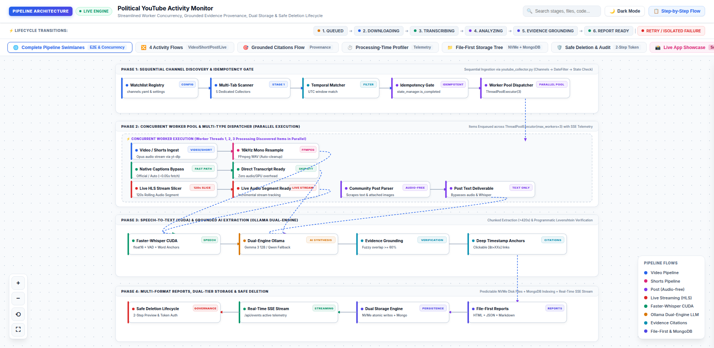
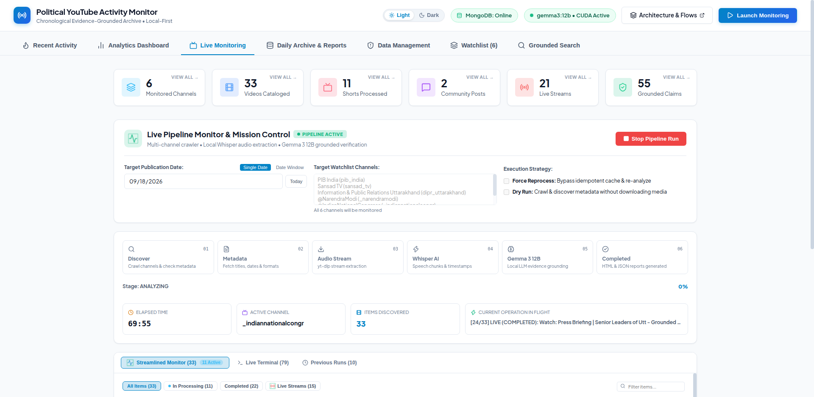
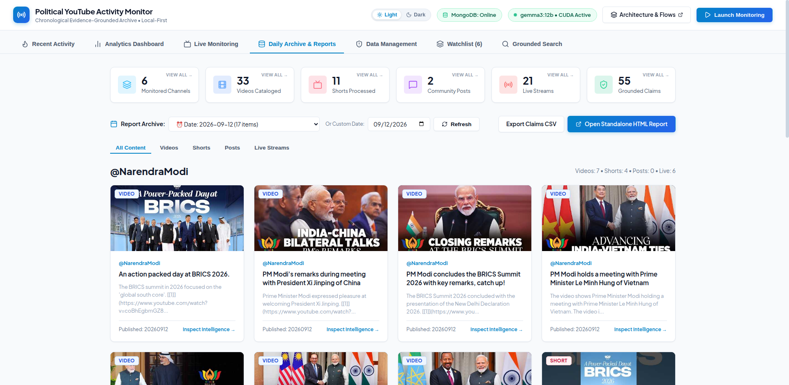
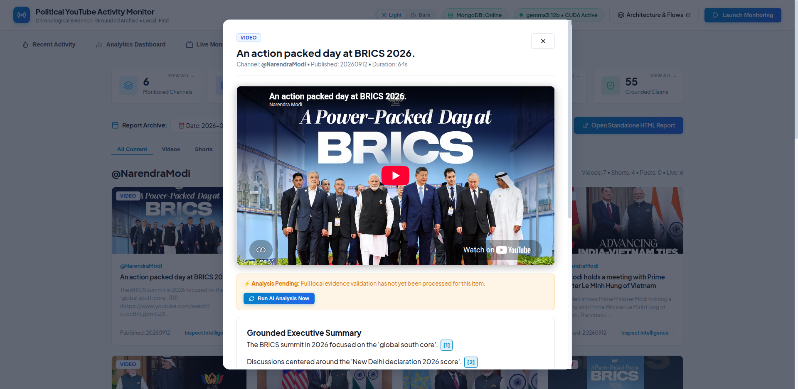
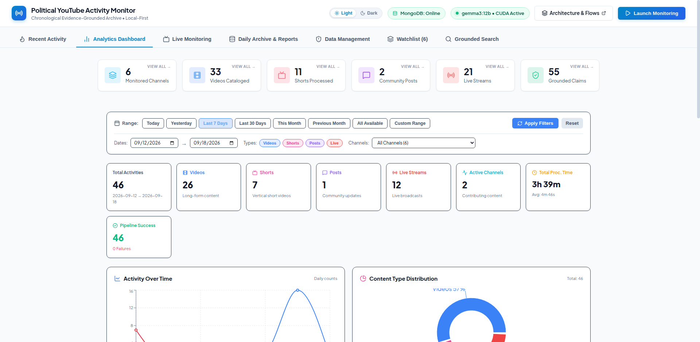
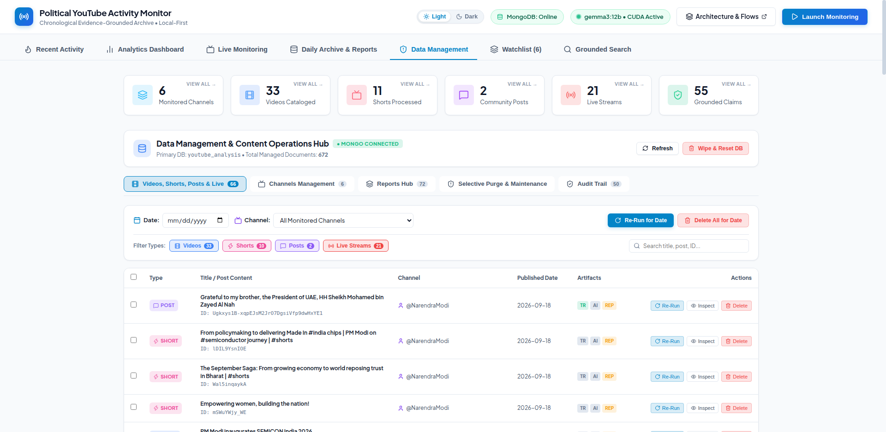

# 🌐 Political YouTube Monitor — Interactive Pipeline Architecture

<p align="center">
  <a href="https://prakharxai.github.io/youtube-pipeline-flow/">
    
  </a>
  
  
  
</p>

### 🚀 [Click Here to View Live Interactive Architecture](https://prakharxai.github.io/youtube-pipeline-flow/)

---

## 📸 Complete System Architecture Preview

The entire end-to-end ingestion, transcription, analysis, grounding, and storage pipeline in high-definition:

<p align="center">
  <a href="https://prakharxai.github.io/youtube-pipeline-flow/">
    
  </a>
</p>

---

## Overview

This repository hosts the **Interactive System Architecture & Pipeline Flow Visualizer** for the Political YouTube Channel Activity Monitor.

Built as a lightweight, zero-dependency, pure client-side web application featuring dynamic interactive SVG diagrams, stage search, clickable component inspections, and detailed data structures.

### ⚡ 6 Lifecycle Transitions Tracked
Every discovered activity transitions deterministically through 6 discrete lifecycle states:
```
[1. QUEUED] ➔ [2. DOWNLOADING] ➔ [3. TRANSCRIBING] ➔ [4. ANALYZING] ➔ [5. EVIDENCE GROUNDING] ➔ [6. REPORT READY]
                                                                                                | [RETRY / ISOLATED FAILURE]
```
- **1. QUEUED**: Activity discovered and pushed into bounded `ThreadPoolExecutor(max_workers=3)`.
- **2. DOWNLOADING**: Fast-path native YouTube captions bypass (~0.05s) or 16kHz mono audio stream extraction.
- **3. TRANSCRIBING**: CUDA-accelerated Faster-Whisper with Silero VAD filtering and word-level timestamps.
- **4. ANALYZING**: Ollama Dual-Engine (Gemma 3 12B primary / Qwen3 8B fallback) with 420s chunking.
- **5. EVIDENCE GROUNDING**: Programmatic Levenshtein fuzzy quote verification and timestamp anchor generation.
- **6. REPORT READY**: Atomic NVMe disk persistence (.tmp rename) and synchronized MongoDB document indexing.
- **RETRY / ISOLATED FAILURE**: Item-level error isolation recording failure telemetry without aborting remaining concurrent workers.

---

## 🧭 Interactive Views & Flow Diagrams

| View | Diagram Preview | Core Capabilities |
| :--- | :--- | :--- |
| **Complete Pipeline Swimlanes** | [`assets/06_pipeline_flow.png`](assets/06_pipeline_flow.png) | End-to-end swimlanes mapping Discovery &rarr; Ingestion &rarr; Speech-to-Text &rarr; LLM Synthesis &rarr; Evidence Grounding &rarr; Reports. |
| **4 Activity Types & Routing** | [`assets/07_activity_routing.png`](assets/07_activity_routing.png) | Dedicated pipelines for Long-Form Videos, YouTube Shorts (<60s), Community Posts (audio-free), and Live Streams. |
| **Dual-Tier Storage Architecture** | [`assets/08_dual_tier_storage.png`](assets/08_dual_tier_storage.png) | NVMe File-First audit hierarchy synchronized with indexed MongoDB document persistence. |
| **Evidence Grounding Engine** | [`assets/09_evidence_grounding.png`](assets/09_evidence_grounding.png) | 3-tier Levenshtein fuzzy matching verifying every LLM statement against verbatim transcripts. |
| **Safe Deletion & Audit** | [`assets/10_safe_deletion_audit.png`](assets/10_safe_deletion_audit.png) | 2-step impact calculation, cryptographic `CONFIRM_DELETE` token gate, and append-only audit trail. |
| **Processing-Time Profiler** | [`assets/11_processing_time_profiler.png`](assets/11_processing_time_profiler.png) | Microsecond phase timers, Real-Time Factor (RTF), CUDA VRAM telemetry, and wall-clock instrumentation. |

---

## 📱 Live Application Console Snapshots

Interactive demonstration of the Political YouTube Activity Monitor running on workstation hardware:

### 1. Live Pipeline Monitor & Mission Control
Real-time concurrent worker execution, 6-stage telemetry track, and live SSE event stream:
<p align="center">
  
</p>

### 2. Historical Archive & Activity Feed
Granular date-partitioned catalog of political content across monitored channels:
<p align="center">
  
</p>

### 3. Grounded Intelligence & Evidence Inspection
Verbatim speech transcript inspection with embedded YouTube player and clickable timestamp anchors:
<p align="center">
  
</p>

### 4. Political Analytics & Sentiment Dashboard
Multi-channel comparative charts, sentiment trajectories, and topical distribution:
<p align="center">
  
</p>

### 5. Safe Data Management & Audit Hub
Controlled purge console with 2-step impact verification and immutable audit trail:
<p align="center">
  
</p>

---

## 💻 Running Locally

No build steps or npm installations required:

```bash
# Option 1: Direct browser launch
open index.html # On macOS
xdg-open index.html # On Linux

# Option 2: Local HTTP server
python3 -m http.server 8080
```
Then visit `http://localhost:8080`.
